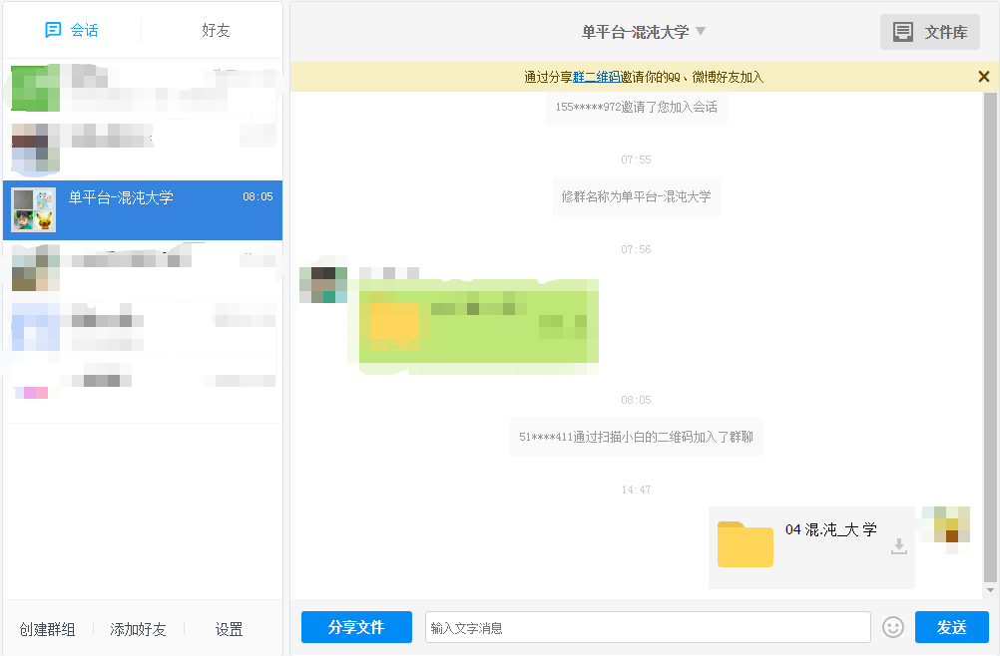
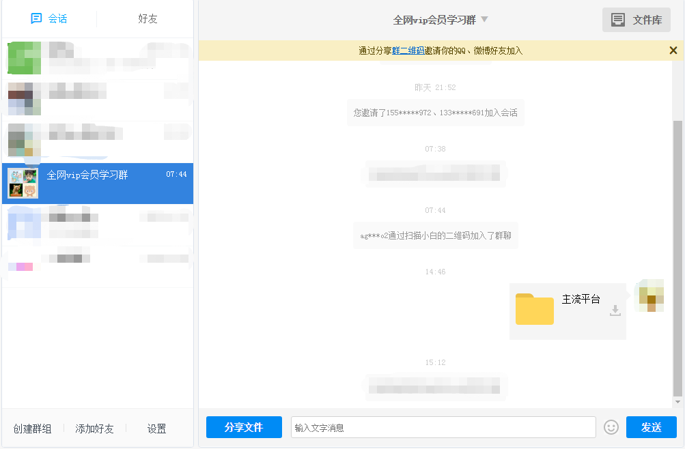

## 资源目录

[实际内容比目录多](http://note.youdao.com/noteshare?id=7fd10758621338e782c6af98f48a7659)

目录可以搜到的资源(搜索方法上面跳转链接有详解)，有偿分享！支持试听试看，非诚勿扰！

## 收费标准

#### 套餐一：单个课程 2元/课程
把目录上搜到的课程名直接复制发给我，我微信分享课程链接你。目录上能找到的，网盘编号路径对应全部都有。没搜到的敬请期待更新！（目前买一赠一）

#### 套餐二：单个平台 10元/永久
单个平台是指比如像'混沌大学'，10元包含目录里看到的所有'混沌大学'平台课程，付费后邀你加入单平台学习群。

如图：

#### 套餐三：全网vip会员 50元/永久
内容包含：目录上看到的所有平台课程，两千多个栏目，100万价值课程，加后期每天更新，每周上新6到7个新栏目。平台随便一个栏目就200元，现只需50元加入全网vip会员共享学习群，永久免费更新！后期课程资源每更新增加3000G 针对后加入会员涨价10元 ，入会60元、70元以此类推，前面会员一次加入永久免费更新，早加入早受益，时间就是金钱，效率就是生命，不要等到价格上涨了说之前咨询价，一律按阶段价。

如图：

## 联系我们

微信添加请备注：**获取付费资源**

否则不予以通过！！！

